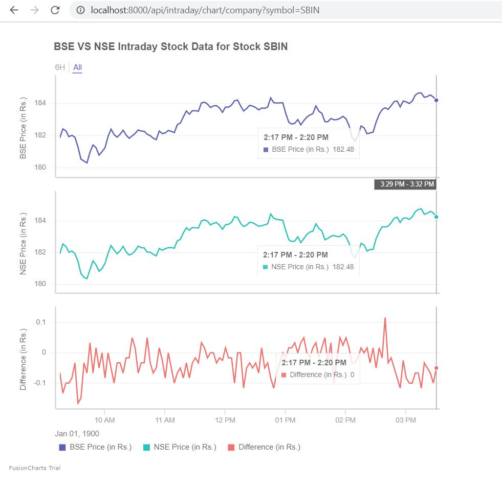
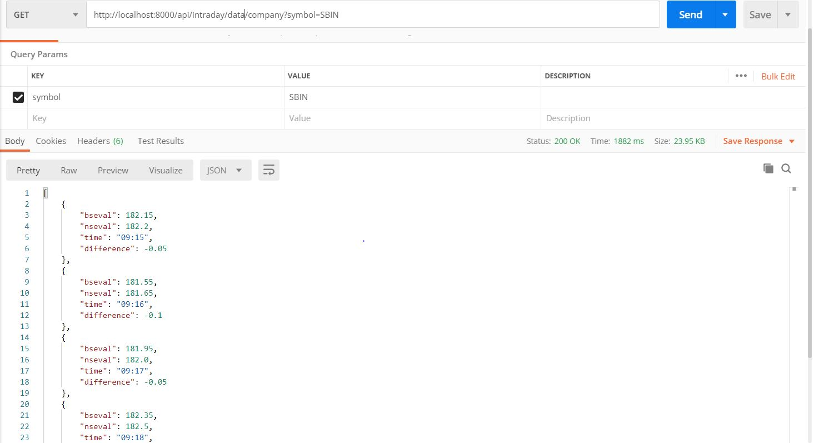

# Intraday-Stock-Analysis
Django App for Intraday Analysis of NSE and BSE Stocks

Data is given in 1 minute interval from analyzing NSE and BSE Data API's

Steps To Run Locally (Python 3 Version 3.8.3):

### Installing steps
****

1. Download the repo with git

2. Open Project directory and follow the steps

```
cd .\xchange\

pip install requirements.txt

python manage.py migrate

python manage.py makemigrations

```

3. Steps to run the application

```
python manange.py runserver
```


4. To see the Intraday Chart data, enter the Stock Symbol as parameter on the link:

```
http://localhost:8000/api/intraday/chart/company?symbol=SBIN
```




5. The Application is also exposed as an API to get JSON Data, test the API in Postman using the following link:

```
http://localhost:8000/api/intraday/chart/company?symbol=SBIN
```

